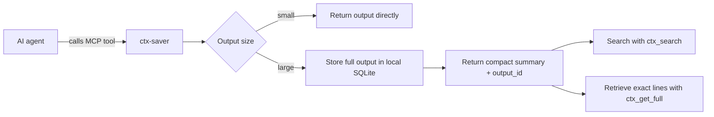
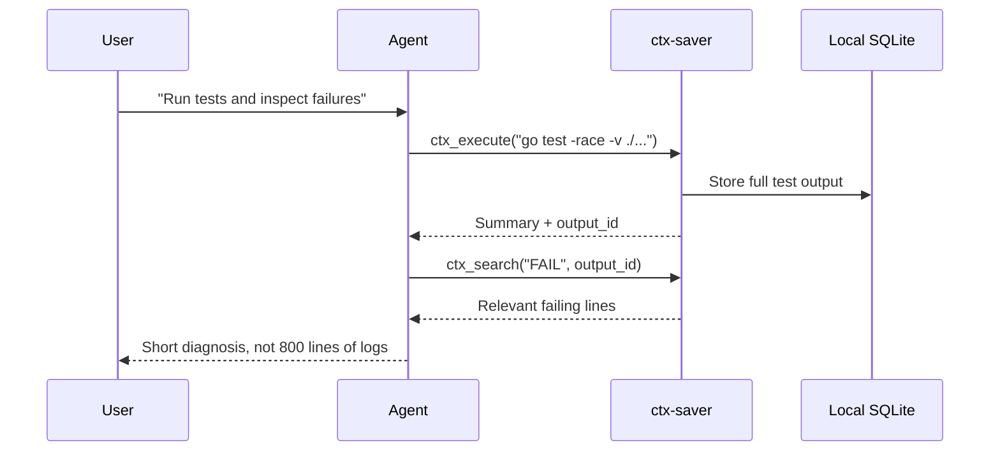

# ctx-saver

**English** | [ภาษาไทย](README.th.md)

ctx-saver is a self-hosted MCP server for AI coding agents. It keeps large command output out of the chat context by storing the full text locally and returning a compact summary instead.

No cloud. No telemetry. No account. Local SQLite only.

## The Problem

AI agents often need to inspect big outputs:

- `go test -race -v ./...`
- `docker logs`, `journalctl`, `kubectl get pods -A`
- `git log --all`, `git diff`, `grep -r`, `find`
- large JSON files, API responses, Jira exports, build logs

Sending all of that text into the model burns context fast. ctx-saver gives the agent the useful summary first, then lets it search or retrieve details only when needed.

## How It Works



The main idea is simple: keep noisy output searchable, but do not spend the whole context window on it.

## Quick Start

### 1. Install

Requires Go 1.25+.

```bash
go install github.com/ChonlakanSutthimatmongkhol/ctx-saver/cmd/ctx-saver@latest
```

Make sure your Go binary directory is in `PATH`:

```bash
export PATH="$PATH:$(go env GOPATH)/bin"
```

Or build from source:

```bash
git clone https://github.com/ChonlakanSutthimatmongkhol/ctx-saver.git
cd ctx-saver
make install
```

### 2. Connect Your AI Client

**Claude Code**

```bash
ctx-saver init claude
```

**Codex CLI**

```bash
ctx-saver init codex
ctx-saver init agents-md
```

Restart Codex CLI after installing hooks.

**VS Code Copilot**

```bash
ctx-saver init copilot
ctx-saver init copilot-instructions
```

Copilot can use ctx-saver MCP tools, but it does not currently run lifecycle hooks automatically. See [Copilot Enterprise Setup](docs/copilot-enterprise-setup.md) for company/enterprise setup notes.

## Daily Usage

Most users only need these tools:

| Tool | Use it for |
|------|------------|
| `ctx_session_init` | Start a session with project rules, recent activity, cached outputs, and saved decisions. Pass `task="..."` to resume task-scoped handoffs. |
| `ctx_execute` | Run shell, Python, Go, or Node commands while storing large output safely. |
| `ctx_read_file` | Read large files without flooding the model context. |
| `ctx_search` | Search stored outputs using full-text search. |
| `ctx_get_full` | Retrieve a full output or exact line range when needed. |
| `ctx_note` | Save/list durable decisions, or use `action="handoff"` with `task="..."` to resume work across sessions. |

Typical agent flow:



## What You Get Back

Large outputs return a compact summary instead of raw text:

```text
format: go_test
packages: 18 passed, 1 failed
failed:
  internal/store TestKnowledgeStatsScan
stored_as: out_20260508_ab12cd34
```

When more detail is needed, the agent can ask for:

```text
ctx_search("TestKnowledgeStatsScan", output_id="out_20260508_ab12cd34")
ctx_get_full(output_id="out_20260508_ab12cd34", line_range=[120, 170])
```

## Token Savings

Measured from real commands run through `ctx_execute` in this repository.

| Command | Raw | Summary | Saving |
|---------|-----|---------|--------|
| `go test -race -v ./...` | 39 KB | 115 B | 99.7% |
| `git log --oneline -500` | 8.7 KB | 155 B | 98.2% |
| Jira JSON export | 88 KB | 320 B | 99.6% |
| `app.log` with 2,000 lines | 177 KB | 1.5 KB | 99.2% |
| `git diff HEAD~5` | 22 KB | 750 B | 96.6% |

Overall benchmark snapshot: 391 KB raw output reduced to 6.1 KB of summaries, about 98.4% smaller.

Run the benchmark locally:

```bash
scripts/benchmark.sh
```

## Key Features

### Smart Summaries

`ctx_execute` detects common output formats and summarizes them with structure:

| Format | Summary includes |
|--------|------------------|
| `go_test` | package counts, failed tests, coverage |
| `flutter_test` | pass/fail/skip counts, failed test names |
| `json` | top-level keys, array length, sample values |
| `git_log` | commit count, newest/oldest commits, top authors |
| `generic` | head + tail lines with omitted-line count |

### Searchable Output

Stored outputs are indexed with SQLite FTS5. `ctx_search` supports:

- special-character auto escaping
- LIKE fallback if FTS5 rejects a query
- synonym expansion for common engineering terms
- optional project-specific synonyms in `.ctx-saver-synonyms.yaml`

### Freshness Checks

Retrieval tools include a `freshness` field so the agent knows whether cached data is still safe to use.

| Level | Age | Agent behavior |
|-------|-----|----------------|
| `fresh` | under 1 hour | use as-is |
| `aging` | 1-24 hours | use as-is, mention age when relevant |
| `stale` | 1-7 days | warn and offer refresh |
| `critical` | over 7 days | ask before using for decisions |

### Hooks

Claude Code and Codex CLI can use hooks for automatic behavior:

| Hook | What it does |
|------|--------------|
| PreToolUse | Blocks dangerous commands and routes likely-large outputs through `ctx_execute`. |
| PostToolUse | Records tool-call summaries for session restoration. |
| SessionStart | Injects project rules and recent history at the start of a session. |

## Configuration

Default config:

```text
~/.config/ctx-saver/config.yaml
```

Project override:

```text
.ctx-saver.yaml
```

Small example:

```yaml
sandbox:
  timeout_seconds: 60

storage:
  data_dir: ~/.local/share/ctx-saver
  retention_days: 14
  max_output_size_mb: 50

summary:
  head_lines: 20
  tail_lines: 5
  auto_index_threshold_bytes: 32768
  smart_format: true
```

Freshness presets are in [configs/freshness-examples](configs/freshness-examples).

## Project Knowledge

After a few sessions, ctx-saver can generate `.ctx-saver/project-knowledge.md` so future AI sessions start with useful project memory:

- most-read files
- most-run commands
- common command sequences
- high-importance decisions grouped by task
- session patterns

```bash
ctx-saver knowledge refresh
ctx-saver knowledge show
ctx-saver knowledge reset
```

## Security

- SQLite database permissions are `0600`
- command deny list is checked before execution
- binary output with null bytes is rejected
- paths are cleaned with `filepath.Abs` and `filepath.Clean`
- command strings in logs are truncated to reduce secret exposure
- no external service is required

## Build

```bash
make build
make test
make lint
make install
```

## More Documentation

- [Copilot Enterprise setup](docs/copilot-enterprise-setup.md)
- [Freshness migration guide](docs/migration-v0.5.md)
- [Cache purge migration guide](docs/migration-v0.6.md)
- [Claude Code config notes](configs/claude-code/README.md)
- [VS Code Copilot config notes](configs/vscode-copilot/README.md)

## Troubleshooting

### Duplicate tool names

When using multiple AI hosts (Claude Code + Copilot + Codex) in the same
environment, you may see tool names like:
- `mcp__ctx-saver__ctx_execute`
- `mcp__plugin__claude_ctx-saver__ctx_execute`

**This is expected behavior.** Each host registers ctx-saver under its own
namespace. Both names point to the same server and the same database —
no data conflict or duplication occurs. The AI host calls the correct
namespace automatically.

### ctx_session_init not called automatically

VS Code Copilot may require `ToolSearch` before calling deferred MCP tools,
which can cause `ctx_session_init` to be unavailable in the first turn. Copilot
Enterprise tools are expected to be pre-registered; if `ctx_session_init` is not
visible there, state the limitation and use the manual fallback from the project
instructions.

**Fix:** Add this line to your instruction file (CLAUDE.md / AGENTS.md /
copilot-instructions.md):

    Your first tool call in every new session must be ctx_session_init.
    If VS Code Copilot has not loaded ctx tools yet, run:
    tool_search("ctx_session_init ctx_execute ctx_read_file ctx_stats ctx_note")

## Design Notes

ctx-saver intentionally uses local subprocesses and SQLite instead of remote services. The threat model is context pollution from huge outputs, not running untrusted software. The goal is to make AI coding sessions more focused, searchable, and recoverable while staying simple enough to audit.
