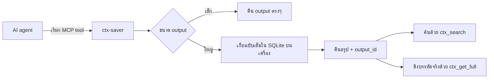
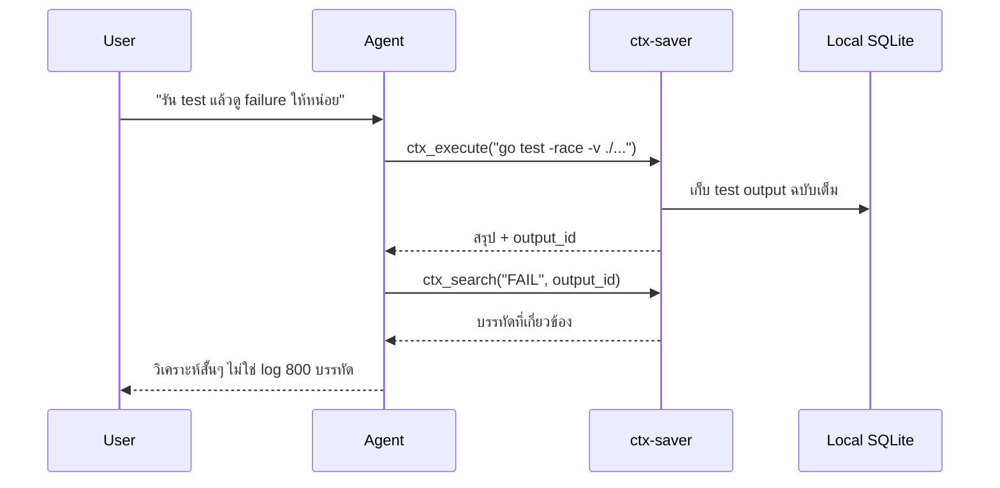

# ctx-saver

[English](README.md) | **ภาษาไทย**

ctx-saver คือ MCP server แบบ self-hosted สำหรับ AI coding agent ช่วยกัน output ขนาดใหญ่ออกจาก context ของแชต โดยเก็บข้อความฉบับเต็มไว้ในเครื่อง แล้วคืนกลับมาเป็นสรุปสั้นๆ แทน

ไม่มีคลาวด์ ไม่มี telemetry ไม่ต้องสมัครบัญชี ใช้ SQLite ในเครื่องเท่านั้น

## ปัญหาที่แก้

AI agent มักต้องอ่าน output ใหญ่ๆ เช่น:

- `go test -race -v ./...`
- `docker logs`, `journalctl`, `kubectl get pods -A`
- `git log --all`, `git diff`, `grep -r`, `find`
- JSON ขนาดใหญ่, API response, Jira export, build log

ถ้าส่งทั้งหมดเข้า model ตรงๆ context จะเต็มเร็วมาก ctx-saver จึงส่งสรุปที่พอใช้ก่อน แล้วค่อยให้ agent ค้นหรือดึงรายละเอียดเฉพาะจุดเมื่อต้องการ

## ภาพรวมการทำงาน



แนวคิดหลักคือ: เก็บ output ที่รกและยาวให้ค้นได้ แต่ไม่เอาทั้งหมดมายัดใส่ context window

## เริ่มต้นใช้งาน

### 1. ติดตั้ง

ต้องการ Go 1.26+

```bash
go install github.com/ChonlakanSutthimatmongkhol/ctx-saver/cmd/ctx-saver@latest
```

ตรวจว่า Go binary directory อยู่ใน `PATH`:

```bash
export PATH="$PATH:$(go env GOPATH)/bin"
```

หรือติดตั้งจาก source:

```bash
git clone https://github.com/ChonlakanSutthimatmongkhol/ctx-saver.git
cd ctx-saver
make install
```

### 2. เชื่อมกับ AI client

**Claude Code**

```bash
ctx-saver init claude
```

**Codex CLI**

```bash
ctx-saver init codex
ctx-saver init agents-md
```

หลังติดตั้ง hooks แล้วให้ restart Codex CLI

**VS Code Copilot**

```bash
ctx-saver setup copilot
ctx-saver doctor
```

คำสั่ง setup จะติดตั้ง MCP และ instructions ในโปรเจกต์ พร้อม hooks ระดับผู้ใช้
ที่ `$COPILOT_HOME/hooks` หรือ `~/.copilot/hooks` ใช้
`ctx-saver setup copilot --repo-hooks` เฉพาะเมื่อต้องการให้ hooks มีผลกับ
ผู้ร่วมงานทุกคน ดูรายละเอียดสำหรับองค์กรได้ที่
[Copilot Enterprise Setup](docs/copilot-enterprise-setup.md)

## ใช้งานประจำวัน

ผู้ใช้ส่วนใหญ่ต้องรู้จักแค่ tools เหล่านี้:

| Tool | ใช้ทำอะไร |
|------|-----------|
| `ctx_session_init` | เริ่ม session พร้อม project rules, activity ล่าสุด, cached outputs, ไฟล์อ้างอิงที่ cache ไว้ (`cached_files`), และ saved decisions; ใส่ `task="..."` เพื่อ resume handoff ของงานนั้น |
| `ctx_execute` | รันคำสั่ง shell, Python, Go, หรือ Node โดยเก็บ output ใหญ่ให้อัตโนมัติ |
| `ctx_read_file` | อ่านไฟล์ใหญ่โดยไม่ทำให้ context แน่น |
| `ctx_search` | ค้น output ที่เคยเก็บไว้ |
| `ctx_get_full` | ดึง output ฉบับเต็มหรือช่วงบรรทัดที่ต้องการ |
| `ctx_note` | บันทึก/ดู decision หรือใช้ `action="handoff"` คู่กับ `task="..."` เพื่อส่งต่องานข้าม session |

ตัวอย่าง flow:



## สิ่งที่ได้กลับมา

เมื่อ output ใหญ่ ระบบจะคืนสรุปแทนข้อความดิบ:

```text
format: go_test
packages: 18 passed, 1 failed
failed:
  internal/store TestKnowledgeStatsScan
stored_as: out_20260508_ab12cd34
```

ถ้าต้องการรายละเอียดเพิ่ม agent ค่อยเรียก:

```text
ctx_search("TestKnowledgeStatsScan", output_id="out_20260508_ab12cd34")
ctx_get_full(output_id="out_20260508_ab12cd34", line_range=[120, 170])
```

## ลด token ได้เท่าไร

`ctx_stats` นับ raw tokens และ response tokens ในเครื่องด้วย tokenizer
`o200k_base` โดยไม่เรียก API และไม่ต้องใช้ API key ข้อมูลเก่าก่อน v0.13.0
จะแสดงใน `untokenized_outputs` และไม่ปนกับเปอร์เซ็นต์แบบ exact
output ที่ใหญ่กว่า 2 MiB จะถูกเก็บก่อนแล้วนับ token ใน background จึงอาจแสดง
ใน `untokenized_outputs` ชั่วคราว ส่วน metric แบบ scalar จะแสดงค่า `0`
เสมอเมื่อ scope ที่เลือกยังไม่มีข้อมูล

วัดจากคำสั่งจริงที่รันผ่าน `ctx_execute` ใน repository นี้

| คำสั่ง | Raw | Summary | ลดลง |
|--------|-----|---------|------|
| `go test -race -v ./...` | 39 KB | 115 B | 99.7% |
| `git log --oneline -500` | 8.7 KB | 155 B | 98.2% |
| Jira JSON export | 88 KB | 320 B | 99.6% |
| `app.log` 2,000 บรรทัด | 177 KB | 1.5 KB | 99.2% |
| `git diff HEAD~5` | 22 KB | 750 B | 96.6% |

Benchmark snapshot รวม: จาก raw output 391 KB เหลือ summary 6.1 KB หรือเล็กลงประมาณ 98.4%

รัน benchmark เองได้ด้วย:

```bash
scripts/benchmark.sh
```

### สุขภาพ Context Window

`ctx_stats` วัดสุขภาพของ context window ไม่ใช่ความถี่ในการใช้ tool โดย
`missed_large_outputs` เป็น metric หลักสำหรับ output ที่ใหญ่เกิน threshold
และหลุดผ่าน native Shell/Read ที่มี annotation ส่วนคำสั่ง git write และ native
Read ของไฟล์ที่แก้ใน session เดียวกันถือว่า sanctioned และไม่ลด adherence
ขณะที่ `adherence_score` ยังคงไว้เป็น metric เชิงข้อมูลเพื่อ backward compatibility

## Features สำคัญ

### Smart Summary

`ctx_execute` ตรวจ format ของ output แล้วสรุปแบบมีโครงสร้าง:

| Format | สรุปอะไรให้ |
|--------|-------------|
| `go_test` | จำนวน package, test ที่ fail, coverage |
| `flutter_test` | pass/fail/skip, test ที่ fail |
| `pytest` | จำนวน pass/fail/skip, test ที่ fail, ระยะเวลา |
| `jest` | จำนวน suite/test, test ที่ fail, ระยะเวลา |
| `build_log` | ผล xcodebuild/Gradle, diagnostic, จำนวน warning |
| `container_log` | error/warning, timeline, panic block แรก |
| `lint` | issue จาก golangci-lint/ESLint แยกตาม rule |
| `json` | top-level keys, ความยาว array, sample values |
| `git_log` | จำนวน commit, commit ใหม่/เก่า, top authors |
| `generic` | head + tail พร้อมจำนวนบรรทัดที่ตัดออก |

ANSI escape สำหรับสี cursor และ terminal title จะถูกลบก่อน detect format,
สร้าง summary, ทำ FTS index และเก็บลงฐานข้อมูล

### ค้น output ได้

output ที่เก็บไว้ถูก index ด้วย SQLite FTS5 และ `ctx_search` รองรับ:

- escape อักขระพิเศษให้อัตโนมัติ
- fallback เป็น LIKE ถ้า FTS5 reject query
- synonym expansion สำหรับคำทาง engineering ที่พบบ่อย
- synonym เฉพาะ project ผ่าน `.ctx-saver-synonyms.yaml`

### เทียบผลการรันซ้ำ

หลังรัน test หรือ build เดิมซ้ำ ให้ดูเฉพาะสิ่งที่เปลี่ยน:

```text
ctx_get_full(output_id="<new>", diff_against="<previous_output_id>")
```

ผลลัพธ์เป็น unified diff พร้อม context 3 บรรทัดและจำนวนบรรทัดที่เพิ่ม/ลบ
diff ขนาดใหญ่จะคืนเฉพาะส่วนหัวและท้ายในขนาดจำกัด

### จัดการพื้นที่จัดเก็บ

body ที่ใหญ่กว่า 4 KiB จะบีบอัดด้วย zstd ส่วน FTS ยังเก็บ plaintext
จึงค้นหาเหมือนเดิมและประหยัดเฉพาะส่วน `full_output` ตั้งค่า
`storage.max_db_size_mb` เพื่อเปิด LRU eviction หรือใช้ `0` แบบไม่จำกัด
output ที่เพิ่งใช้และ decision จะไม่ถูกลบ

### Freshness Check

ทุก retrieval tool มี field `freshness` เพื่อให้ agent รู้ว่าข้อมูล cache ยังน่าใช้แค่ไหน

| Level | อายุ | พฤติกรรมของ agent |
|-------|-----|-------------------|
| `fresh` | น้อยกว่า 1 ชั่วโมง | ใช้ได้เลย |
| `aging` | 1-24 ชั่วโมง | ใช้ได้ แจ้งอายุถ้าเกี่ยวข้อง |
| `stale` | 1-7 วัน | เตือนและเสนอ refresh |
| `critical` | มากกว่า 7 วัน | ถามก่อนใช้ตัดสินใจ |

### Secret Redaction (ลบความลับ)

output จากคำสั่งและไฟล์จะถูกลบ secret pattern ที่รู้จัก **ก่อน** ถูก summarise, ส่งกลับให้ model
หรือเขียนลง SQLite โดยแทนที่ด้วย `[REDACTED:<rule>]` และรายงานชื่อ rule ใน `stats.redacted_rules`

rule เริ่มต้นครอบคลุม private key block, AWS access key, GitHub/GitLab/Slack token, JWT,
`Bearer` token และ secret แบบ `key=value` (เช่น `password=…`, `api_key: …`)
เปิดใช้งานโดย default เพิ่ม pattern เองหรือปิดได้ผ่าน config block `redaction`
SourceHash สำหรับ cache ไฟล์ยังคำนวณจากไฟล์จริงบน disk การ invalidate cache จึงไม่กระทบ

> redaction มีผลกับ output ใหม่เท่านั้น — row ที่เก็บไว้ก่อน upgrade ไม่ถูกลบย้อนหลัง ใช้ `ctx_purge` ถ้าต้องการล้าง

### ไฟล์อ้างอิงที่ cache ไว้ (Cached Files)

`ctx_session_init` คืน list `cached_files` ของไฟล์ที่เคยอ่านไว้ พร้อม SHA สั้นๆ, freshness และ flag
`changed_on_disk` (re-hash ไฟล์ตอน init) agent นำกลับมาใช้ผ่าน `ctx_search` / `ctx_get_full` ได้ตั้งแต่
turn 1 แทนการอ่านซ้ำ ถ้า `changed_on_disk=true` ให้อ่านใหม่ด้วย `ctx_read_file` ก่อน

### Hooks

| Host | MCP | Hooks | การกู้ session |
|------|-----|-------|---------------|
| Claude Code | มี | มี | inject context ผ่าน SessionStart |
| Codex CLI | มี | มี | instructions + events ที่บันทึกไว้ |
| GitHub Copilot | มี | มี | instructions เรียก `ctx_session_init` |

| Hook | ทำอะไร |
|------|--------|
| PreToolUse | บล็อกคำสั่งอันตราย และ route output ที่น่าจะใหญ่ผ่าน `ctx_execute` |
| PostToolUse | บันทึก summary ของ tool call เพื่อกู้ session context |
| SessionStart | inject context บน host ที่รองรับ; Copilot บันทึก event แต่ไม่อ่าน output ของ hook |

## การตั้งค่า

config หลัก:

```text
~/.config/ctx-saver/config.yaml
```

config เฉพาะ project:

```text
.ctx-saver.yaml
```

ตัวอย่างสั้นๆ:

```yaml
sandbox:
  timeout_seconds: 60

storage:
  data_dir: ~/.local/share/ctx-saver
  retention_days: 14
  max_output_size_mb: 50
  max_db_size_mb: 0       # 0 = ไม่จำกัด; เกิน cap แล้วลบ output เก่า

summary:
  head_lines: 20
  tail_lines: 5
  auto_index_threshold_bytes: 32768
  smart_format: true

hooks:
  session_history_limit: 10
  view_deny_threshold_bytes: 131072  # 0 = ปิด Copilot reference-read denial

redaction:
  enabled: true            # ลบ secret ก่อนเก็บ (default: true)
  extra_patterns:          # rule ที่ผู้ใช้กำหนดเอง merge หลัง default
    - name: internal_ticket
      regex: 'INT-[0-9]{6}'
```

ตัวอย่าง freshness presets อยู่ที่ [configs/freshness-examples](configs/freshness-examples)

## Project Knowledge

หลังใช้งานไปสักพัก ctx-saver สร้าง `.ctx-saver/project-knowledge.md` ได้ เพื่อให้ session ถัดไปรู้จัก project มากขึ้น:

- ไฟล์ที่อ่านบ่อย
- คำสั่งที่รันบ่อย
- ลำดับคำสั่งที่มักใช้คู่กัน
- decision สำคัญ แยกตาม task
- รูปแบบ session

```bash
ctx-saver knowledge refresh
ctx-saver knowledge show
ctx-saver knowledge reset
```

## ความปลอดภัย

- SQLite database ใช้ permission `0600`
- ตรวจ command deny list ก่อน execute
- ปฏิเสธ binary output ที่มี null bytes
- clean path ด้วย `filepath.Abs` และ `filepath.Clean`
- log ตัด command string ให้สั้นลงเพื่อลดโอกาสหลุด secret
- ลบ secret ออกจาก output ก่อนเก็บ (ดู [Secret Redaction](#secret-redaction-ลบความลับ))
- ไม่ต้องใช้ external service

## Build

```bash
make build
make test
make lint
make install
```

## เอกสารเพิ่มเติม

- [Copilot Enterprise setup](docs/copilot-enterprise-setup.md)
- [Freshness migration guide](docs/migration-v0.5.md)
- [Cache purge migration guide](docs/migration-v0.6.md)
- [Claude Code config notes](configs/claude-code/README.md)
- [VS Code Copilot config notes](configs/vscode-copilot/README.md)

## การแก้ปัญหาเบื้องต้น

### ชื่อ tool ซ้ำกัน

เมื่อใช้หลาย AI host พร้อมกัน (Claude Code + Copilot + Codex) อาจเห็นชื่อ tool ซ้ำ เช่น:
- `mcp__ctx-saver__ctx_execute`
- `mcp__plugin__claude_ctx-saver__ctx_execute`

**นี่คือพฤติกรรมที่ถูกต้อง** แต่ละ host ลงทะเบียน ctx-saver ภายใต้ namespace ของตัวเอง
ทั้งสองชื่อชี้ไปยัง server และ database เดียวกัน — ไม่มีการซ้ำซ้อนหรือ conflict ของข้อมูล
AI host แต่ละตัวจะเรียก namespace ของตัวเองโดยอัตโนมัติ ไม่ต้องตั้งค่าเพิ่มเติม

### ctx_session_init ไม่ถูกเรียกอัตโนมัติ

VS Code Copilot อาจต้องทำ `ToolSearch` ก่อนเรียก MCP tools ที่ยังถูก defer อยู่
ทำให้ `ctx_session_init` ยังไม่ visible ใน turn แรก ส่วน Copilot Enterprise ควร
pre-register tools ไว้แล้ว ถ้าไม่เห็น `ctx_session_init` ให้บอก limitation นั้น
ตรงๆ แล้วใช้ manual fallback จาก project instructions

**วิธีแก้:** เพิ่มบรรทัดนี้ในไฟล์คำสั่ง (CLAUDE.md / AGENTS.md / copilot-instructions.md):

    Your first tool call in every new session must be ctx_session_init.
    If VS Code Copilot has not loaded ctx tools yet, run:
    tool_search("ctx_session_init ctx_execute ctx_read_file ctx_stats ctx_note")

ถ้า Copilot หา `ctx_stats` ไม่เจอ ให้รัน `ctx-saver doctor` ก่อน หาก stdio
smoke test ผ่าน ให้ Reload Window, restart ctx-saver ใน **MCP: List Servers**,
เปิดแชตใหม่ แล้วเรียก `tool_search` ด้านบน

## Design Notes

ctx-saver ตั้งใจใช้ subprocess และ SQLite ในเครื่อง แทนการพึ่ง remote service ภัยหลักที่แก้คือ context pollution จาก output ขนาดใหญ่ ไม่ใช่การ sandbox software ที่ไม่น่าเชื่อถือ เป้าหมายคือทำให้ AI coding session โฟกัสขึ้น ค้นย้อนหลังได้ และ audit ง่าย
